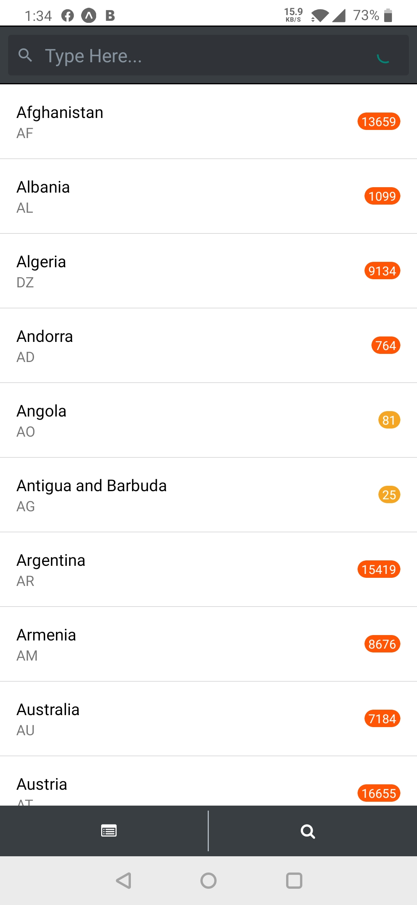
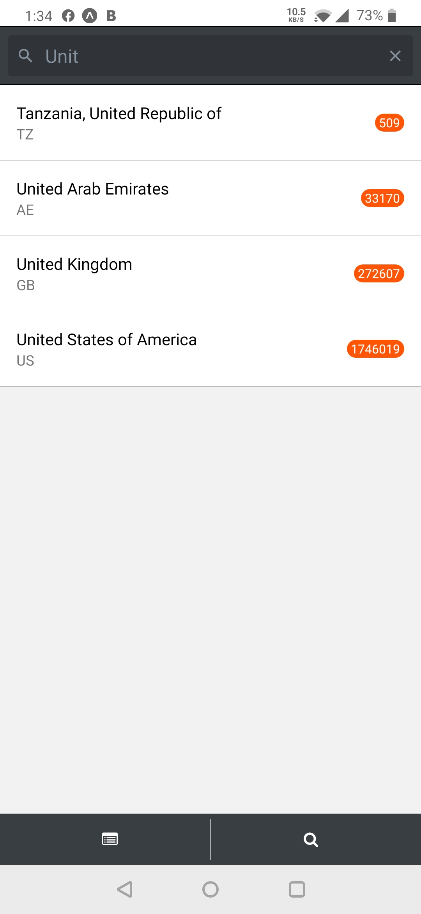
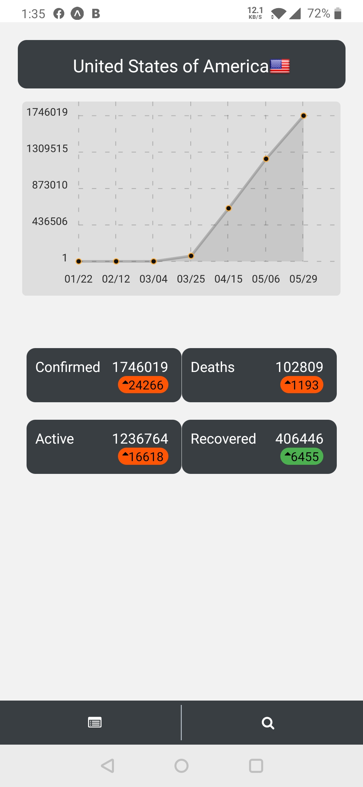

# Covid-19

## Install & Build

First, make sure you have Expo CLI installed: npm install -g expo-cli

Install: yarn or yarn install

Run Project Locally: expo start or yarn dev

## Screenshots

### Menu Screen

### Search Screen

### Detail Screen

